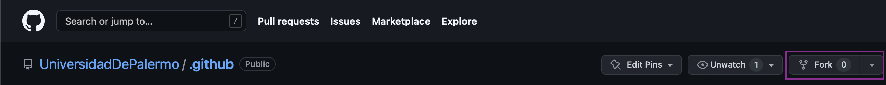
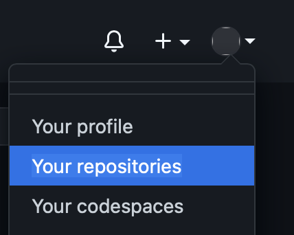
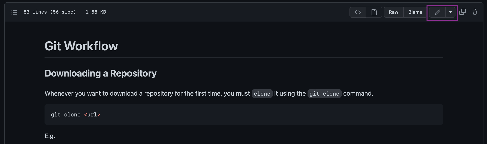
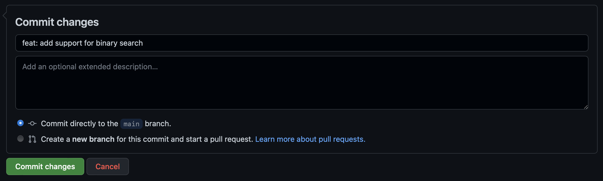

# ¿Cómo Contribuir?

La razón principal por la que se creó esta organización fue la de incentivar
a estudiantes de la universidad a contribuir en el Open Source a través de
GitHub.

GitHub es la plataforma de software más grande que existe, donde albergan
millones de repositorios de código usados en una variedad de proyectos de
todas partes. Desde empresas como Apple, Microsoft y IBM hasta usuarios
que hacen proyectos independientes que han servido en un sin fin de productos.

Es muy probable que ya conozcas Git y GitHub, sobre todo si ya has trabajado
desarrollando o manteniendo software, sea por proyectos personales o trabajo.
Si es así aqui no hay mucho que ver, pero si eres nuevo en este área es muy
probable que esta guía de contribuición sea de utilidad.

## Contribuyendo a través de la UI de GitHub

Si bien GitHub funciona sobre Git, no es necesario que descarges y configures
Git en tu sistema para contribuir. La plataforma de GitHub cuenta con una serie
de herramientas que pueden simplificar la tarea de proveer modificaciones al
código existente en un repositorio.

### Regístrate en GitHub

Primero deberas de crear un usuario en GitHub, visita: https://github.com/signup
para proceder.

### Hacer `fork` de un repositorio

Para empezar a colaborar, deberas hacer `fork` del repositorio en cuestión.
Para ello [visita la página del repositorio][1] y presiona click en el botón
**fork** de la parte superior.

  

Este botón creará una copia legítima del repositorio en tu cuenta personal, al
que tendras permisos de lectura y escritura. Podrás modificar cada aspecto de
esta copia.

### Realizar cambios

Una vez hecho el fork, visita el repositorio en la sección de repositorios de
tu perfil.

  

Allí encontraras un listado de repositorios a los que puedes realizar cambios,
sean creados por tí o clonados usando **fork**.

Abre el repositorio de tu interés y búsca el archivo que deseas modificar.

Una vez abierto el archivo, podrás realizar cambios en el haciendo click en
el lápiz de edición en la parte superior, lateral izquierdo, de la
previsualización del archivo.

  

Realiza los cambios, puedes reemplazar todos los contenidos que desees.
Una vez realizados los cambios, deberas de crear un **commit**.

> Básicamente **commit** es un conjunto de uno o más fragmentos de cambios
> realizados en un directorio y/o archivo. Bien sea crear o eliminar un archivo
> ó modificar los contenidos de uno o más archivos.

Para el commit se deben especificar 2 valores, un título y una descripción.
El título no debe de contener más de 50 caracteres. La descripción puede no
ser especificada. La misma no tiene un máximo recomendado de caracteres.

> La convención recomendada para el formato de commits es [Conventional Commits][2].

  

Finalmente, haz click en el botón _Commit changes_. Esto realizara el cambio
en tu copia del repositorio.

### Creando un "Pull Request" para sugerir cambios

Los cambios realizados en un repositorio personal a partir de un fork, pueden
ser reflejados en el repositorio principal, es decir, el repositorio al que se
hizo el fork en primer lugar.

Para ello deberas de crear un **Pull Request**, el **Pull Request** es el medio
por el cual se sugieren cambios a un repositorio al que queremos contribuir,
visita tu copia del repositorio y dirigete a el tab **Pull Requests**.

  

Una vez allí, deberás de hacer click en el botón **New pull request**.

  

Sigue los pasos en pantalla para crear el pull request. Los mantendores o
colaboradores del repositorio al que hiciste fork, someteran a revisión tus
cambios, podrán hacer sugerencias antes de fusionar tus cambios con los del
repositorio de la otra parte ó sencillamente fusionaran los cambios si no hay
lugar a comentarios.

[1]: https://github.com/UniversidadDePalermo/.github
[2]: http://conventionalcommits.org
